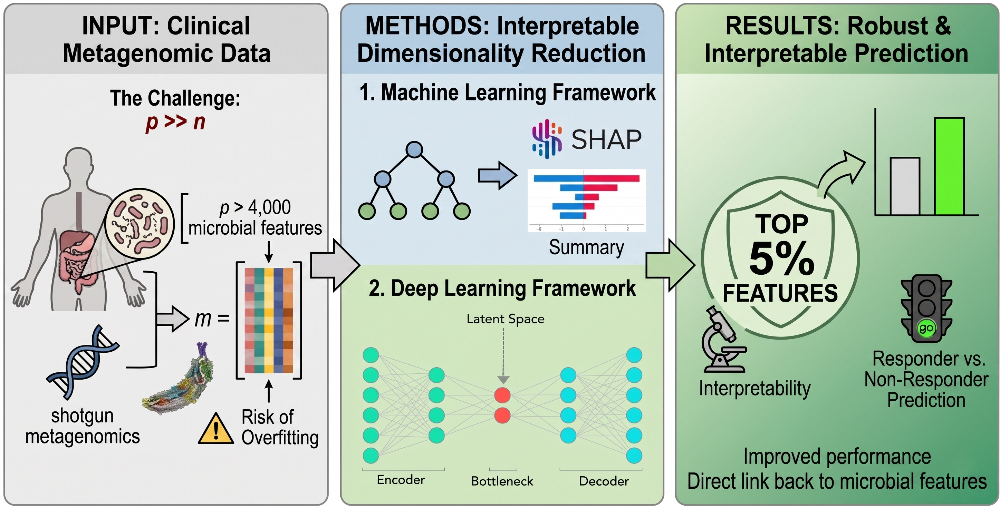

# SuperResponder

This repository hosts the code used to analyze gut microbioma data for the Paper "Toward Precision Oncology: Machine and Deep Learning Prediction of Immunotherapy Response from Gut Microbiome Profiles". 

<p align="center">

</p>

Authors:
- Giovanni Cappelletti (mail: giovanni.cappelletti@unimore.it)
- Matteo Lombardi      (mail: matteo.lombardi@unimore.it)
## Repo Structure
```
SuperResponder/
├──  analysis                    # Contains data analysis code, including SHAP features extractor
│   ├── clustering.py            # Clustering methods grouped in a class. Not used for the paper
│   ├── correlation.py           # Methods to analyze correlation between metadata
│   ├── dim_reduction.py         # Dimensionality reduction methods such as PCA, KPCA 
│   └── explainability.py        # SHAP explainer wrapper class
├──  config                      # Contains yaml config files used to quickly change experiment configurations  
├──  datasets                    # Data folder, must be created to host the data file (e.g. CSV files).
├──  fileio                      # Helper methods for reading and writing files  
│   ├── df_loader.py             # Loads and saves data in memory, handling some preprocessing steps
│   └── serialization.py         # Utils to write results files to disk   
├──  logger                      # Logging methods
├──  models                      # Classes to handle models hyperparams from configs file and cross validation
│   ├── component_registry.py    # Maps strings to class names for quick config changes
│   ├── models.py                # Code to handle models and cross validation
│   └── suggestion_functions.py  # Utils functions for Optuna package    
├── preprocessing                # Helper methods to preprocess data
│   ├── preprocess.py            # Sklearn pipeline builder 
│   └── transformers.py          # Preprocessing functions (CLR, scaling)
├── scripts                      # Experiments
├── utils                        # Utils methods
│   ├── splitter.py              # Splits data into train/test sets based on yaml config file
│   ├── utils.py                 # Miscellaneous utilities functions
│   └── validators.py            # Config files sanity checkers 
├── visualization                # Plotting functions
├── environment.yml              # Conda env config file to recreate environment. Includes pip dependencies
└── requirements.txt             # Pip dependencies file
```

## Installation
Create a conda environment using the yml file:
```
conda env create -f environment.yml
```
It should also install the required pip packages. If it does not, enter the environment and install pip dependencies manually:
```
conda activate responder
pip install -r requirements.txt
```

## Supported models

The repo is heavily based on and inspired by the scikit-learn package.
Supported models now include:
- Logistic Regression
- Ridge Regression
- Support Vector Machines
- Multi Layer Perceptron
- Random Forest
- Extra Trees
- XGBoost

Not all of these models were heavily tested, so there might be some instabilities/bugs. Feel free to open an Issue if you notice problems.

## Run Experiments

The ```scripts``` folders contains the code of the experiments used to produce results reported in the paper. In particular, ```models/feature_ablation_study.py``` contains the SHAP top features study code and ```models/top_features.py``` the top bacteria species intersection study. 

Create a folder named ```datasets``` and copy the data file into it. You can find the CSV file here:
https://drive.google.com/file/d/1pTqmrwlL63eZ5uwnWHAa9V0f3pa5MduM/view?usp=drive_link
Please send a request to access the file specifying your name, institution affiliation and research interest, we will then share the data file with you.

To run the experiments, first modify the config files to your need. For example, to change the models hyperparameter grid search space, change the ```models.yaml``` config file. Refer to the component registry under the models folder for info on how to write each class name in the conf file.
Simply launch the scripts with:

```
python models/feature_ablation_study.py
python models/top_features.py
```

## Contribute

If you want to contribute to this project, please first check if a feature is not already implemented, then open a Pull Request with your changes. We will evaluate the changes and eventually integrate them into our project.

## License
This project is licensed under the CC BY-NC-SA 4.0 License. See the LICENSE file for details.


## Citation

This repository is the official implementation of the following paper, currently submitted at Artificial Intelligence in Medicine:

Cappelletti, G., et al. "Toward Precision Oncology: Machine and Deep Learning Prediction of Immunotherapy Response from Gut Microbiome Profiles." (2026). Submitted for publication.

## Acknowledgements

DISCLAIMER: This repository was primarily developed as a refactoring excercise for one of the authors, so most features may seem overengineered and unnecessary. The work is a combination of multiple repos merged into one, so some parts may feel detached from others (e.g. clustering).     

This work is based on [Scikit-Learn](https://github.com/scikit-learn/scikit-learn) python package, so we thank the authors for their great work.

The code structure is inspired by [MMSegmentation](https://github.com/open-mmlab/mmsegmentation), but has no affiliations with it, neither does it use methods from openmmlab repositories. It was merely an inspiration on how to structure the code, thanks to the author for their great work.